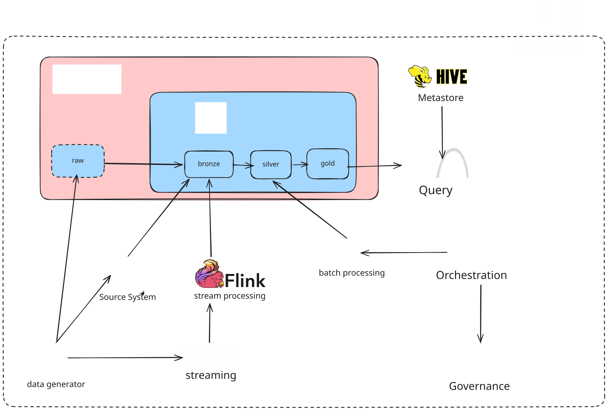

# 🍜 Food Delivery Data Platform

Nền tảng dữ liệu end-to-end cho một ứng dụng **đặt đồ ăn** (ShopeeFood/GrabFood-style),
biến dữ liệu thô nhiều lỗi thành mô hình dữ liệu sạch phục vụ phân tích và ML. Hệ thống
được xây trên **Airflow, Spark, Flink, Kafka, Delta Lake, MinIO, Trino, Hive Metastore,
PostgreSQL** và **DataHub**, đóng gói toàn bộ bằng **Docker Compose**.

Luồng nghiệp vụ: khách đặt món → quán chuẩn bị → match tài xế → giao hàng → đánh giá.
Từ luồng đó, nền tảng sinh **dữ liệu offline** (đơn, khách, quán, tài xế, thực đơn, đánh
giá) và **dữ liệu streaming** (sự kiện GPS/trạng thái đơn), rồi xử lý qua các tầng
Bronze → Silver → Gold.

---

## 💥 Bài toán — dữ liệu sinh có chủ đích

Dữ liệu được sinh ra kèm đúng các vấn đề thường gặp trong thực tế, để chứng minh khả năng
xử lý:


| Nhóm           | Vấn đề                                                                                                                                                          |
| --------------- | ------------------------------------------------------------------------------------------------------------------------------------------------------------------ |
| Offline (batch) | **skew** theo thành phố/danh mục · **high cardinality** (`menu_item_id`) · **schema evolution** (`spice_level` xuất hiện từ tháng 2) · **duplicate** ~2% |
| Streaming       | **burst** giờ cao điểm · **late arrival** ~8% · **duplicate** ~1.5%                                                                                           |

Mỗi vấn đề được xử lý ở tầng tương ứng (Spark cho batch, Flink cho streaming) kèm số liệu
đo trước/sau tối ưu.

---

## 📕 Table of Contents

- 🌟 [System Architecture](#-system-architecture)
- 📁 [Repository Structure](#-repository-structure)
- 🚀 [Getting Started](#-getting-started)
- 🔧 [Features & How it works](#-features--how-it-works)
  - [1. Data Generation](#1-data-generation)
  - [2. Ingestion to Bronze](#2-ingestion-to-bronze)
  - [3. Batch Processing (Spark)](#3-batch-processing-spark)
  - [4. Stream Processing (Flink)](#4-stream-processing-flink)
  - [5. Storage Optimization](#5-storage-optimization)
  - [6. Transformation to Silver / Gold](#6-transformation-to-silver--gold)
  - [7. Feature Store](#7-feature-store)
  - [8. Data Governance](#8-data-governance)
  - [9. Schema Design](#9-schema-design)
  - [10. Docker Optimization](#10-docker-optimization)
- 🌐 [Service Endpoints](#-service-endpoints)
- 📌 [Documentation](#-documentation)

---

## 🌟 System Architecture



Mỗi khối là một **deployable unit** trong `docker-compose.yml`. Mũi tên nét liền đi theo
chiều dữ liệu, đánh số theo thứ tự luồng:


| #  | Luồng                  | Mô tả                                 |
| -- | ----------------------- | --------------------------------------- |
| 1  | Generator → MinIO      | ghi dữ liệu offline (parquet)         |
| 2  | Generator → PostgreSQL | ghi danh mục (dim) vào`source_system` |
| 3  | Generator → Kafka      | produce sự kiện streaming             |
| 4  | MinIO → Bronze         | ingest raw (batch)                      |
| 5  | PostgreSQL → Bronze    | ingest raw (batch)                      |
| 6  | Kafka → Flink          | đọc stream sự kiện                  |
| 7  | Flink → Bronze         | ghi sự kiện đã xử lý              |
| 8  | Bronze → Spark         | đọc để xử lý batch                |
| 9  | Spark → Silver         | chuẩn hoá + dedup                     |
| 10 | Silver → Gold          | build dim/fact (SCD2) + feature         |
| 11 | Hive metastore → Trino | cấp metadata bảng Delta               |
| 12 | Gold → Trino           | truy vấn Delta bằng SQL               |
| 13 | Airflow → Spark        | điều phối các pipeline              |
| 14 | Airflow → DataHub      | đẩy lineage + data contract           |

---

## 📁 Repository Structure

```shell
project/
├── data_generator/            /* Sinh dữ liệu offline + streaming (config-driven) */
│   ├── config/generator.yaml  /*   Toàn bộ tham số sinh dữ liệu — không hardcode */
│   ├── main.py                /*   Entry: python -m data_generator.main --mode offline */
│   ├── offline/               /*   dimensions / facts / writer → MinIO + Postgres */
│   ├── streaming/             /*   events + producer → Kafka */
│   └── profile_output.py      /*   Đo chất lượng data: skew, cardinality, null, dup */
│
├── dags/                      /* Airflow DAGs — 3 pipeline dữ liệu */
│   ├── dp1_ingest_bronze.py   /*   Nguồn ngoài → Bronze (ingest + validate) */
│   ├── dp2_transform_gold.py  /*   Bronze → Silver/Gold (SCD2 star) */
│   ├── dp3_compute_features.py/*   Gold → feature table (feat_*) */
│   └── spark_offline_processing.py  /* Chạy các job xử lý offline problems */
│
├── jobs/
│   ├── spark/                 /* Spark jobs (submit qua Airflow) */
│   │   ├── job_skew.py        /*   Xử lý skew (salting / repartition) */
│   │   ├── job_cardinality.py /*   approx_count_distinct + bucketing */
│   │   ├── job_schema_evolution.py  /* mergeSchema + null spice_level */
│   │   ├── job_dedup.py       /*   Dedup window + row_number */
│   │   ├── job_storage_lakehouse.py /* Compaction + Z-order (Delta) */
│   │   ├── dp2_build_gold.py  /*   Build dim/fact SCD2 */
│   │   ├── dp3_build_features.py     /* Build feat_* tables */
│   │   └── register_bronze_tables.py/* Đăng ký raw_* vào metastore (DBeaver) */
│   ├── flink/                 /* Flink streaming: burst/late/dedup + windowing */
│   └── dwh/dwh_indexing.py    /* Postgres indexing (DWH) */
│
├── governance/datahub_emit.py /* Emit dataset + lineage + assertion + data contract */
├── docker/                    /* Dockerfile & config từng service (+ datahub/) */
├── docs/                      /* Tài liệu chi tiết + docs/proof/ (screenshots) */
│   └── architecture.svg       /*   Sơ đồ triển khai (nhúng ở trên) */
├── docker-compose.yml         /* 17 service cụm chính (DataHub deploy compose riêng) */
└── README.md
```

---

## 🚀 Getting Started

```bash
# 1. Khởi động cụm chính (17 service)
docker compose up -d

# 2. Sinh dữ liệu (thu nhỏ để thử nhanh, giữ nguyên mọi tỷ lệ skew/lỗi)
python -m data_generator.main --mode offline --scale 0.05 --upload
python -m data_generator.main --mode stream          # đẩy streaming vào Kafka

# 3. Chạy pipeline: trigger các DAG trên Airflow UI theo thứ tự
#    dp1_ingest_bronze → dp2_transform_gold → dp3_compute_features

# 4. Governance (DataHub) chạy compose riêng — xem docs/Governance.md
```

> Mọi credential (MinIO/Postgres/Kafka) đặt trong **Airflow Connections/Variables**,
> không hardcode trong DAG — tái sử dụng xuyên suốt các pipeline.

---

## 🔧 Features & How it works

### 1. Data Generation

Bộ sinh dữ liệu config-driven (`generator.yaml`) tạo cả dữ liệu offline (lưu MinIO +
Postgres, giả lập "phòng ban khác") lẫn streaming (đẩy Kafka), kèm đầy đủ các vấn đề dữ
liệu bẩn ở bảng trên. `profile_output.py` in ra số liệu định lượng (phân bố skew,
`approx_count_distinct`, tỷ lệ null/duplicate, burst/late rate).
📄 [DataGenerator.md](docs/DataGenerator.md)

### 2. Ingestion to Bronze

Pipeline **DP1** (Airflow) gồm 2 giai đoạn **Ingest → Validate**: kéo song song từ MinIO
(4 bảng lớn), Postgres (3 danh mục), Kafka (1 luồng sự kiện) vào 8 bảng `raw_*`, rồi kiểm
tra schema / số dòng / null / duplicate.
📄 [DP1_Ingestion.md](docs/DP1_Ingestion.md)

### 3. Batch Processing (Spark)

Từng vấn đề offline được xử lý và đo trước/sau bằng Spark UI: **skew** (salting /
repartition), **high cardinality** (`approx_count_distinct` + bucketing), **schema
evolution** (`mergeSchema` + xử lý null), **duplicate** (`window + row_number`). Job chạy
qua Airflow, không submit tay.
📄 [SparkOptimization.md](docs/SparkOptimization.md)

### 4. Stream Processing (Flink)

Xử lý luồng Kafka và đo trên Flink UI: **burst** (tăng parallelism), **late arrival**
(watermark bounded out-of-orderness), **duplicate** (dedup operator + keyed state), cùng
**windowing** (tumbling 5 phút tính `avg_delivery_speed`).
📄 [FlinkOptimization.md](docs/FlinkOptimization.md)

### 5. Storage Optimization

**Lakehouse**: Delta `OPTIMIZE` + **Z-order** gom hàng trăm tệp nhỏ thành 1 tệp lớn
(200 → 1) và bật data skipping — truy vấn nhanh ~2.4×. **Datawarehouse**: index Postgres
đổi kế hoạch từ Seq Scan sang Bitmap Index — nhanh ~24×.
📄 [StorageOptimization.md](docs/StorageOptimization.md)

### 6. Transformation to Silver / Gold

Pipeline **DP2** biến Bronze thành mô hình chuẩn: bảng `stg_*` (Silver, đã sạch) và star
schema Gold — `dim_*` chuẩn **SCD2** (`valid_from_ts`, `valid_to_ts`, `is_current`) +
`fact_*`. Bảng Delta trên lakehouse, đồng thời mirror sang Postgres để có khoá ngoại thật
cho ERD.
📄 [DP2_Transformation.md](docs/DP2_Transformation.md)

### 7. Feature Store

Pipeline **DP3** tính các bảng feature offline chuẩn Feast (có `event_timestamp` +
`created`): `feat_customer_order_freq_7d`, `feat_restaurant_avg_prep_time_30d`,
`feat_driver_acceptance_rate_7d`.
📄 [DP3_Features.md](docs/DP3_Features.md)

### 8. Data Governance

Đẩy **lineage** (pipeline ↔ bảng), **assertion** (luật chất lượng) và **data contract**
của cả DP1/DP2/DP3 lên **DataHub** — mỗi pipeline hiện thành DataFlow/DataJob với đồ thị
lineage vào/ra.
📄 [Governance.md](docs/Governance.md)

### 9. Schema Design

Naming convention nhất quán — Bronze/Silver: `raw_*` / `stg_*`; Gold: `dim_*` / `fact_*` /
`feat_*`. Toàn bộ bảng của 3 zone hiển thị trên DBeaver (qua Trino), quan hệ dim–fact
export ERD từ Postgres.


| Zone               | Bảng                                                                                                                                      |
| ------------------ | ------------------------------------------------------------------------------------------------------------------------------------------ |
| Bronze (`raw_*`)   | `raw_orders`, `raw_order_items`, `raw_menu_items`, `raw_customers`, `raw_restaurants`, `raw_drivers`, `raw_reviews`, `raw_delivery_events` |
| Silver (`stg_*`)   | `stg_orders`, `stg_delivery_events`                                                                                                        |
| Gold — dim (SCD2) | `dim_customer`, `dim_restaurant`, `dim_driver`, `dim_menu_item`                                                                            |
| Gold — fact       | `fact_orders`, `fact_order_items`, `fact_delivery_events`                                                                                  |
| Gold — feature    | `feat_customer_order_freq_7d`, `feat_restaurant_avg_prep_time_30d`, `feat_driver_acceptance_rate_7d`                                       |

### 10. Docker Optimization

Image tự build dùng **multistage** để giảm dung lượng (loại build tools, slim base, cache
layer) — có bảng so sánh size trước/sau.
📄 [DockerOptimization.md](docs/DockerOptimization.md)

---

## 🌐 Service Endpoints


| Service       | UI / Endpoint          | Vai trò                                        |
| ------------- | ---------------------- | ----------------------------------------------- |
| Airflow       | http://localhost:8080  | Orchestration                                   |
| MinIO Console | http://localhost:9001  | Object storage (lakehouse)                      |
| Kafka UI      | http://localhost:8086  | Xem topic/message                               |
| Spark Master  | http://localhost:8081  | Batch processing                                |
| Spark History | http://localhost:18080 | Job đã chạy                                  |
| Flink UI      | http://localhost:8082  | Stream processing                               |
| Trino         | http://localhost:8085  | SQL query engine (DBeaver kết nối vào đây) |
| PostgreSQL    | localhost:5432         | Source system + warehouse mirror                |
| DataHub       | http://localhost:9002  | Governance (compose riêng)                     |

---

## 📌 Documentation

Mỗi chức năng có tài liệu chi tiết kèm screenshot proof trong `docs/` và `docs/proof/`:

[DataGenerator](docs/DataGenerator.md) ·
[DP1 Ingestion](docs/DP1_Ingestion.md) ·
[Spark](docs/SparkOptimization.md) ·
[Flink](docs/FlinkOptimization.md) ·
[Storage](docs/StorageOptimization.md) ·
[DP2 Transformation](docs/DP2_Transformation.md) ·
[DP3 Features](docs/DP3_Features.md) ·
[Governance](docs/Governance.md) ·
[Docker](docs/DockerOptimization.md)
